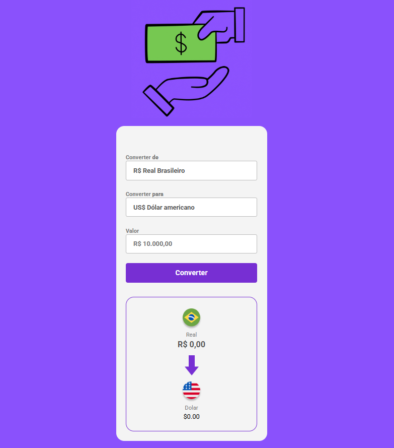

  <h1>💰 Converty Money</h1>
  
  
  
  
<strong>Uma aplicação web moderna e intuitiva para conversão de moedas em tempo real</strong>

  

    
    
    
  

  

    <strong>Navegação Rápida:</strong> 
    <a href="#-sobre">Sobre</a> • 
    <a href="#-funcionalidades">Funcionalidades</a> • 
    <a href="#-tecnologias">Tecnologias</a> • 
    <a href="#-como-usar">Como Usar</a> • 
    <a href="#-instalação">Instalação</a> • 
    <a href="#-contribuição">Contribuição</a>
  

<h2>📋 Sobre</h2>

O <strong>Converty Money</strong> é uma aplicação web responsiva desenvolvida para conversão de moedas internacionais. Com uma interface moderna e user-friendly, permite aos usuários converter valores entre diferentes moedas de forma rápida e precisa.

<strong>🔌 Integração com API:</strong> Esta aplicação utiliza a <em>AwesomeAPI</em> para obter cotações <strong>em tempo real</strong>. A conversão depende exclusivamente da API (sem fallback local) e os controles ficam temporariamente desabilitados até o carregamento das taxas.

Este projeto foi desenvolvido como parte do aprendizado no <a href="https://aulas.devclub.com.br/m/courses">DevClub</a> e expandido com funcionalidades adicionais e melhorias de design.

<h2>✨ Funcionalidades</h2>

<ul>
  <li>🔄 <strong>Conversão em tempo real (via API)</strong></li>
  <li>⏱️ <strong>Atualização automática</strong>: cotações renovadas a cada 15 minutos</li>
  <li>🛡️ <strong>Sem fallback</strong>: UI desabilita em caso de erro de API e exibe mensagem</li>
  <li>🌍 <strong>Múltiplas Moedas</strong>: Suporte para Real, Dólar, Euro, Bitcoin e Libra</li>
  <li>📱 <strong>Design Responsivo</strong>: Interface adaptada para desktop, tablet e mobile</li>
  <li>🎨 <strong>Interface Moderna</strong>: Design clean e profissional</li>
  <li>⚡ <strong>Performance Otimizada</strong>: Carregamento rápido e interações fluidas</li>
</ul>

<h2>🚀 Tecnologias</h2>

Este projeto foi desenvolvido utilizando as seguintes tecnologias:

<ul>
  <li><strong>HTML5</strong>: Estrutura semântica e acessível</li>
  <li><strong>CSS3</strong>: Estilização moderna com flexbox e responsividade</li>
  <li><strong>JavaScript ES6+</strong>: Lógica de conversão e manipulação do DOM</li>
  <li><strong>API de câmbio</strong>: AwesomeAPI (USD/BRL, EUR/BRL, GBP/BRL, BTC/BRL)</li>
</ul>

<h2>🎯 Como Usar</h2>

<ol>
  <li><strong>Abra a aplicação</strong> e aguarde o carregamento das cotações (os controles ficam desabilitados até concluir)</li>
  <li><strong>Selecione a moeda de origem</strong> no primeiro dropdown</li>
  <li><strong>Escolha a moeda de destino</strong> no segundo dropdown</li>
  <li><strong>Digite o valor</strong> que deseja converter</li>
  <li><strong>Clique em "Converter"</strong> para ver o resultado</li>
  <li><strong>Visualize o resultado</strong> nas caixas de moedas abaixo</li>
</ol>

<h3>Moedas Disponíveis</h3>

<table>
  <tr>
    <th>Moeda</th>
    <th>Símbolo</th>
    <th>Código</th>
  </tr>
  <tr>
    <td>Real Brasileiro</td>
    <td>R$</td>
    <td>BRL</td>
  </tr>
  <tr>
    <td>Dólar Americano</td>
    <td>US$</td>
    <td>USD</td>
  </tr>
  <tr>
    <td>Euro</td>
    <td>€</td>
    <td>EUR</td>
  </tr>
  <tr>
    <td>Bitcoin</td>
    <td>₿</td>
    <td>BTC</td>
  </tr>
  <tr>
    <td>Libra Esterlina</td>
    <td>£</td>
    <td>GBP</td>
  </tr>
</table>

<h2>🔧 Instalação</h2>

<h3>Pré-requisitos</h3>

<ul>
  <li>Navegador web moderno (Chrome, Firefox, Safari, Edge)</li>
  <li>Servidor local (recomendado para evitar bloqueios de CORS ao acessar a API)</li>
</ul>

<h3>Passos para instalação</h3>

<ol>
  <li><strong>Clone o repositório</strong>
    <pre><code>git clone https://github.com/LuizZonetti1/Converty-Money.git</code></pre>
  </li>
  
  <li><strong>Navegue até o diretório</strong>
    <pre><code>cd Converty-Money</code></pre>
  </li>
  
  <li><strong>Abra o arquivo no navegador</strong>
    <pre><code># Opção 1: Abrir diretamente
open index.html

# Opção 2: Usar um servidor local
# Com Python 3
python -m http.server 8000

# Com Node.js (http-server)
npx http-server</code></pre>
  </li>
</ol>

<h2>📁 Estrutura do Projeto</h2>

<pre>
Converty-Money/
├── 📄 index.html          # Página principal
├── 🎨 style.css           # Estilos da aplicação
├── ⚡ scripts.js          # Lógica JavaScript
├── 📖 README.md           # Documentação
└── 📂 assets/             # Recursos estáticos
    ├── 🖼️ logo.gif        # Logo da aplicação
    ├── 🖼️ bitcoin.png     # Ícone Bitcoin
    ├── 🖼️ Dolar.png       # Ícone Dólar
    ├── 🖼️ Euro.png        # Ícone Euro
    ├── 🖼️ libra.png       # Ícone Libra
    ├── 🖼️ real.png        # Ícone Real
    ├── 🖼️ Vector.png      # Seta de conversão
    └── 🖼️ imgDesktop.png  # Screenshot
</pre>

<h2>🌟 Demonstração</h2>

  

<h2>🎨 Design System</h2>

<ul>
  <li><strong>Cores Primárias</strong>: Tons de roxo (#8A51FC, #772FD3)</li>
  <li><strong>Tipografia</strong>: Roboto (Google Fonts)</li>
  <li><strong>Layout</strong>: Mobile-first, responsivo</li>
  <li><strong>Componentes</strong>: Cards com sombras suaves</li>
  <li><strong>Interações</strong>: Hover effects e transições suaves</li>
</ul>

<h2>🔄 Atualizações Futuras</h2>

<ul>
  <li>☐ Histórico de conversões</li>
  <li>☐ Gráficos de variação cambial</li>
  <li>☐ Modo escuro</li>
  <li>☐ PWA (Progressive Web App)</li>
  <li>☐ Calculadora de impostos</li>
  <li>☐ Múltiplas linguagens</li>
</ul>

<h2>❗ Comportamento em caso de erro</h2>

Se a API não responder, os controles permanecem desabilitados e a tela exibirá <em>“Erro ao buscar cotações”</em>. Tente recarregar a página ou aguarde a atualização automática.

<h2>🤝 Contribuição</h2>

Contribuições são sempre bem-vindas! Siga os passos abaixo:

<ol>
  <li><strong>Fork o projeto</strong></li>
  <li><strong>Crie uma branch</strong> para sua feature (<code>git checkout -b feature/AmazingFeature</code>)</li>
  <li><strong>Commit suas mudanças</strong> (<code>git commit -m 'Add some AmazingFeature'</code>)</li>
  <li><strong>Push para a branch</strong> (<code>git push origin feature/AmazingFeature</code>)</li>
  <li><strong>Abra um Pull Request</strong></li>
</ol>

<h2>📝 Licença</h2>

Este projeto está sob a licença MIT. Veja o arquivo <a href="LICENSE">LICENSE</a> para mais detalhes.

<h2>👨‍💻 Autor</h2>

<strong>Luiz Zonetti</strong>

<ul>
  <li>GitHub: <a href="https://github.com/LuizZonetti1">@LuizZonetti1</a></li>
  <li>LinkedIn: <a href="https://linkedin.com/in/seu-perfil">Seu LinkedIn</a></li>
</ul>

  
<strong>Desenvolvido com ❤️ por Luiz Zonetti</strong>

  
⭐ Se este projeto te ajudou, deixe uma estrela!

